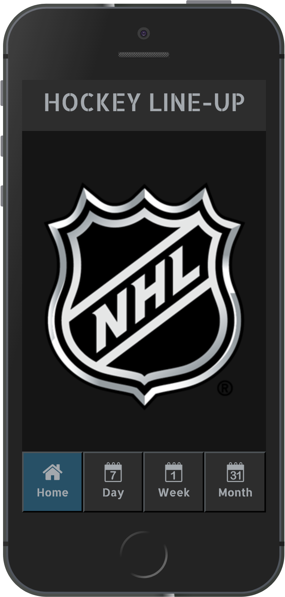
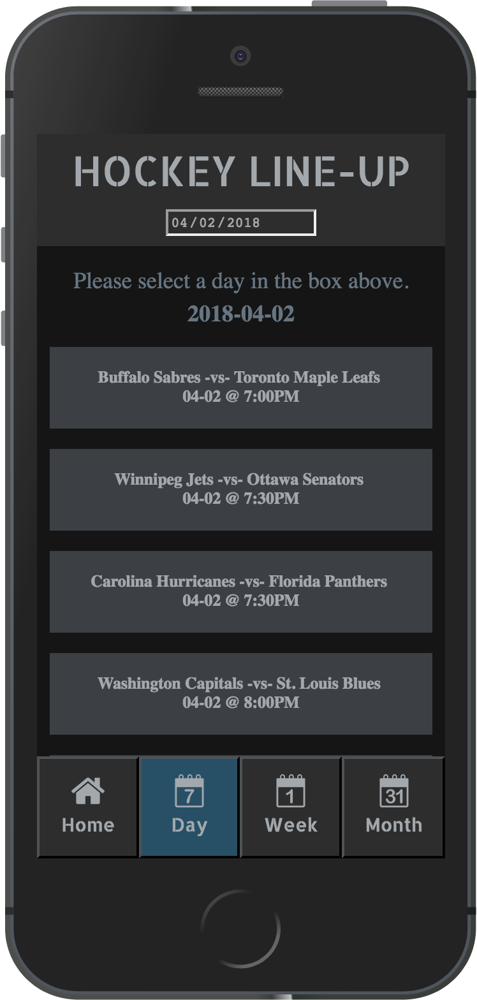
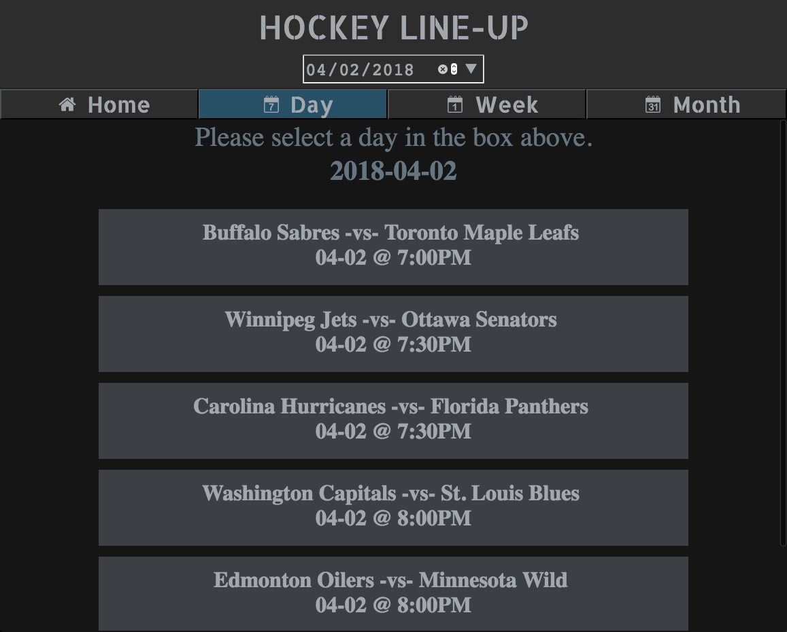

# Hockey Line-Up

## Description

This person project was created using React, React-redux, BrowserRouter, Async Await. For this project I started with the 'create-react-app' boilerplate to make an NHL Schedule app that pulls in the current from MySportsFeeds api. The user can then sort the games by selecting a day, week, or month. Jest, Enzyme, and manual mock implementation were used to test the app along with PropTypes to validate props passed to each component.

## Set Up

### API

Visit https://www.mysportsfeeds.com/ to create an account to get a username and password.

You will need to store this in a file `./src/apiKey.js` saved as variables named username and password.

### Front-end

Clone this project

Run `npm install` from the root directory

Run `npm start`

You can run the testing suite with `npm test`.

## Future

This app currently supports only the current NHL season. The api provides information as far back as 2007 and I would like to incorporate those seasons. Being able to log in as a user and selecting a favorite team would allow me to style the app based on the teams three primary colors. Also, a time zone could be selected and other user specific information or filters could be possible. Most importantly, the original concept for this app was built around live updates and scoreboards for NHL games in progress. I would love to implement that if deeper access to the api was permitted.

## Screenshot

### Mobile Home Page

### Mobile Day Page

### Desktop Day Page
